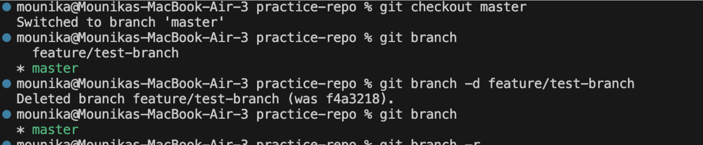

# Assignment 3 – Mounika Garikipati

## Activity 1: Git Configuration

### Configure Global User Name and Email
To start using Git properly, I configured my global and local settings. I ran the following commands to set my name and email both globally and locally:

git config --global user.name "Mounika Garikipati" 
git config --global user.email "mounikagarikipati9@gmail.com" 
# Local Configuration 
git config --local user.name "Mounika Garikipati" 
git config --local user.email "mounikagarikipati9@gmail.com

# View Config
To verify my configurations, I used:

git config --global --list git config --local --list 

I learned that global config is useful when I'm working on my own personal system, where the same name and email are used for all repositories. On the other hand, local config is helpful when I work with multiple GitHub accounts or on a shared computer. It lets me set a different name and email for just that project.

## Working with a local repo

### Create a new local repo 
To create a new local Git repository, I navigated into my project folder and used: git init.
This initialized an empty Git repo and created a hidden .git folder where Git tracks all the changes. It also showed that I was on the default branch (master or main).

### CLoning a public repo to my local repo. 
To clone a remote GitHub repository to my local machine, I used:

#### Clone my own repo 
 - git clone https://github.com/mounikagarikipati/mounikagarikipati.github.io.git 
cd mounikagarikipati.github.io 
#### Why clone? 
Cloning is helpful because it not only downloads the repo but also sets the remote (called origin) automatically, so I can push or pull changes easily without extra configuration.
 - `git clone` copies a remote repository and sets the origin so you can push/pull directly. </pre>

## Git Status and Add 
### Check Git status git status 
After making changes or adding new files, I used git status to check which files were untracked, modified, or staged. This helped me confirm what was ready for commit.

### Create and add file 

I created a new file and used:
to stage it for commit. Git doesn’t include changes in a commit unless they are staged first.

### Commit the staged file (local commit only)
to commit it to the local repository. This saved a snapshot of the file at that moment.

### gitignore Example

Some files like .DS_Store (from macOS) or temporary logs shouldn't be tracked by Git. I created a .gitignore file and listed those filenames inside. Git then ignored them during staging or committing, which kept my repository clean and free of unnecessary system files.

### Delete Files via Git
When a file is under version control in Git (meaning it has been added and committed), it’s best not to delete it using your operating system (like dragging it to Trash in Finder or deleting it with File Explorer). This is because Git won’t automatically know what to do with the deletion. Instead, Git will detect that the file is missing, but the deletion won’t be recorded unless you explicitly tell Git to remove it.
When I create a .gitignore file like this, I’m telling Git to ignore any file that ends with .log and the entire temp/ folder. This means Git won’t track these files.But if the files were never committed or tracked before, Git is already ignoring them, so I can delete them using normal Finder or terminal commands like rm without involving Git.
The correct way to delete a file tracked by Git is to use the command git rm filename, followed by a commit. This ensures Git both deletes the file from your working directory and records the deletion in the version history. For example:

## Working with a remote
git fetch just checks for new data.

git pull fetches and merges the changes into your local branch.

I practiced both above and saw that fetch did not alter my files, while pull asked to merge.

While working on my local repository, I tried to commit changes using git commit -m "Update README with latest sync notes", but Git showed a message saying that nothing was added to commit. It also listed some untracked files, specifically .DS_Store (a hidden macOS system file) and the folder mounikagarikipati.github.io/. This means that Git saw these files but didn’t include them because I hadn’t staged them yet using git add. Since .DS_Store is just a system file and shouldn’t be tracked, I added it to my .gitignore file. Then I staged the folder I actually wanted to commit using git add mounikagarikipati.github.io/, and only after that, I was able to commit the changes successfully. This helped me better understand the importance of staging files before committing and using .gitignore to avoid unnecessary clutter in version control.

## Branching
Branching in Git allows you to create separate lines of development within the same repository. It's used to safely work on new features, bug fixes, or experiments without affecting the main or production codebase.
I practiced working with branches. First, I listed all the branches using git branch. Then, I created a new branch called feature/test-branch and immediately switched to it using git checkout -b. This is useful when I want to work on a new feature without affecting the main code.

I ran git branch again to confirm that the new branch was created. Once I was done, I switched back to the main branch using git checkout main.

Finally, since the test branch wasn't needed anymore, I deleted it with git branch -d feature/test-branch. This command only works if the branch has already been merged or if no commits were made. If it had unmerged changes, I would have to force-delete it with -D.

