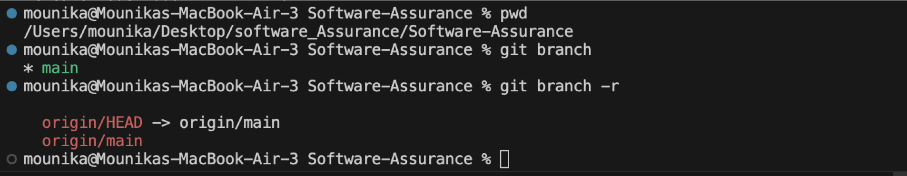
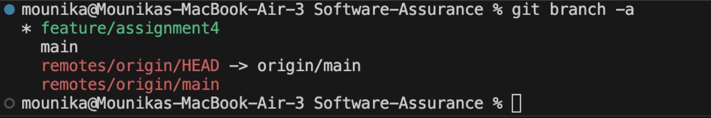

# Assignment 4 – Mounika Garikipati

##  Objective  
This assignment helped me practice branching and understand basic Git Flow, including creating, switching, committing, and merging branches both locally and on GitHub.

## Activity 1: Working with Branches

### Step 1: Created a New Feature Branch  
I created a feature branch using Visual Studio Code by clicking the branch icon in the bottom left and selecting **+ Create new branch**.  
I named the branch: feature/assignment4
before adding new branch

after adding:

### Step 3: Committed Changes on the New Branch

I made some changes to my markdown file (Assignment4Garikipati.md) on the feature/assignment4 branch and committed them:

