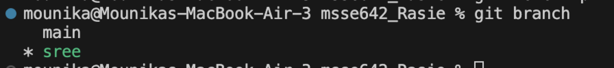
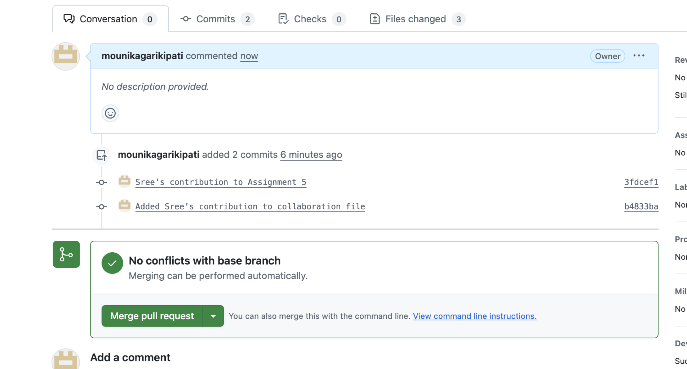
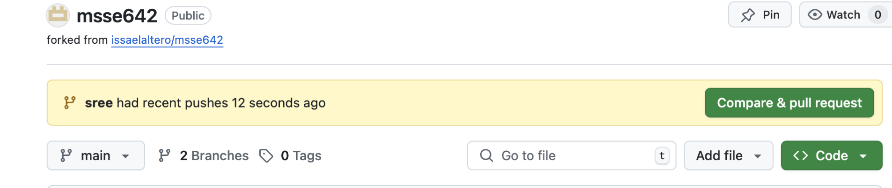
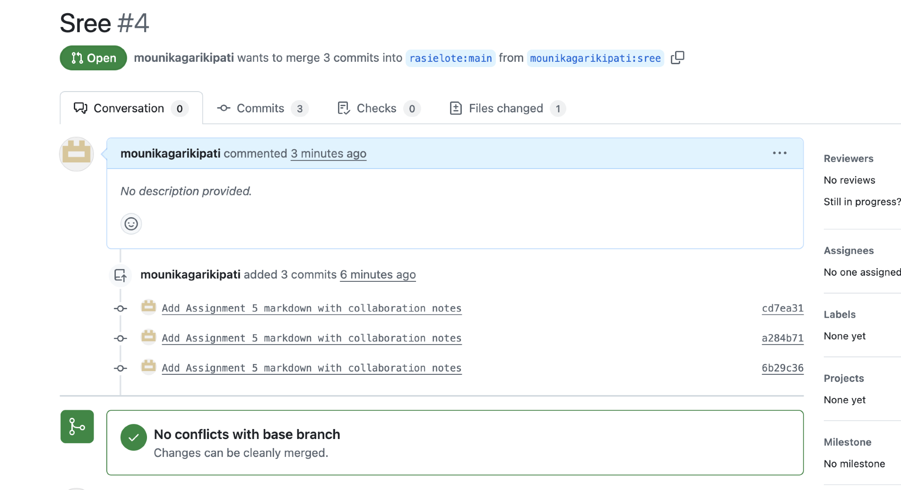
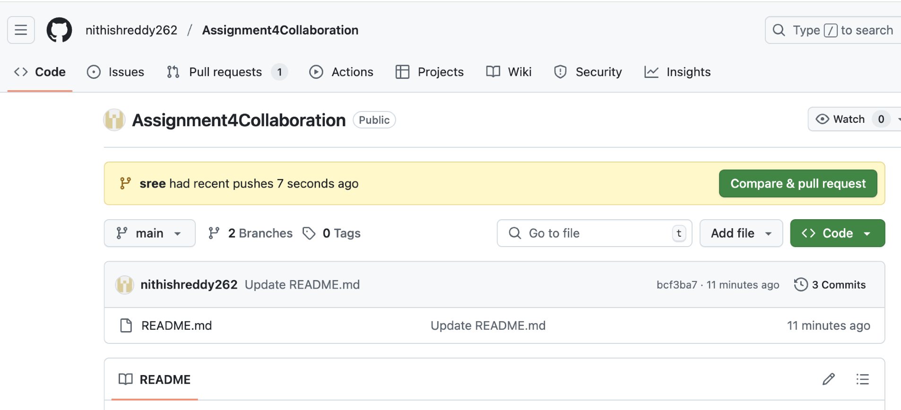
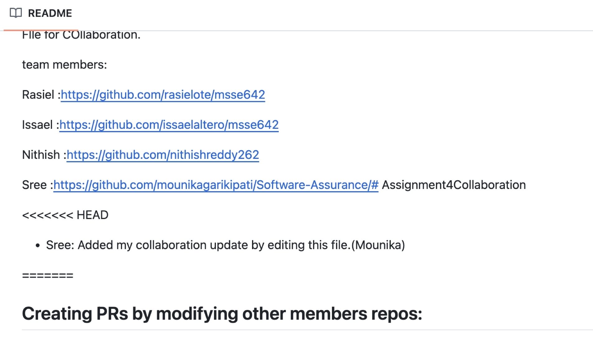
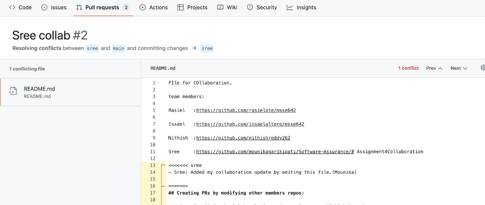
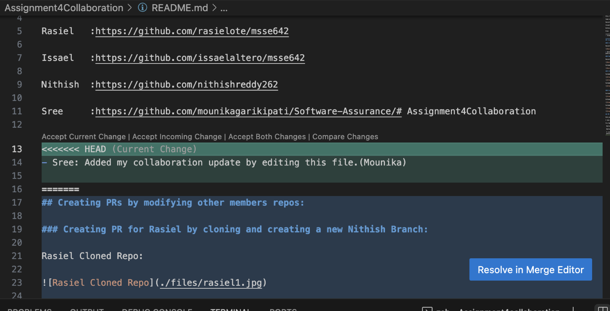

## Assignment 5
### Objective
This week I practiced collaborating using Git by cloning my teammates’ repositories, creating my own branches, contributing to a shared markdown file, and submitting pull requests. This activity helped reinforce how collaborative development works and how to handle contributions and conflicts.
### STEP 1: Cloned My Teammates’ Repositories
I cloned the repositories of my Team A members using the following commands in the terminal:

git clone https://github.com/rasielote/msse642.git

git clone https://github.com/issaelaltero/msse642.git

git clone https://github.com/nithishreddy262/Assignment4Collaboration.git

Each of these created a local folder on my system, one per teammate repo.

### STEP 2: Created My Own Branch
For each teammate’s repo, I navigated into the folder and created a new branch with my name:

cd msse642   # or the repo folder
git checkout -b sree
This allowed me to work on my changes without affecting their main branch.

### STEP 3: Edited the Collaboration File
Inside each repo, I opened the file named Assignment4CollaborationFile.md and added my contribution at the bottom like:

### STEP 4: Staged, Committed, and Pushed Changes
After editing the file, I staged and committed my changes with:

git add Assignment4CollaborationFile.md
git commit -m "Sree’s contribution to collaboration file"
git push --set-upstream origin sree
If I faced any errors during push, I ensured I was on the correct branch and that the file was committed properly.

- Sree: Practiced collaboration by branching and contributing to this repo.
In one case (Issael’s repo), I used the file Assignment5CollaborationFile.md as that was what existed there

### STEP 5: Created a Pull Request on GitHub
Once my changes were pushed, I visited the respective GitHub repo. GitHub automatically showed a "Compare & pull request" option for my branch.

I submitted a pull request with a message like:
"Added Sree’s collaboration update"

In the case of Nithish’s repo, I was added as a collaborator, so I could push directly without needing to fork.

### STEP 6: Merge Conflict (Real Scenario)
While working on Nithish’s repository, both he and I made changes to the same file—Assignment4CollaborationFile.md—at the same time. When I tried to submit a pull request with my changes, GitHub showed that the file had merge conflicts because the same sections of the file had been modified in different ways.

Since we were both online, we were able to communicate directly and resolve the conflict together. Nithish reviewed the conflict, manually accepted both our contributions, and then completed the merge. This experience helped me understand how important communication and coordination are when collaborating on the same file in Git.

### STEP 7: Cleaned Up Local Metadata
After the PR was merged and the remote branch was deleted, I ran:

git fetch -p
This cleaned up stale references to remote branches locally.

